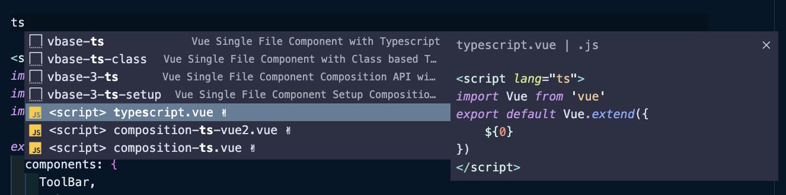

# hacker-news

## Introduce
・vue-typescriptの学習資料

## Project setup
・[vue-settings](https://github.com/hanjh363/vue-settings)参考
・axiosインストール
```
npm i axios
```
・node v14.16.0

## Overwrite this project with the existing project
```
./src以下のディレクトリー確認
```

## Quiz
### feature/hacker-news_4-quiz-router-hoc-util

1. tsconfig.jsonファイルを以下のように修正
```
...
"strict": false, // 修正
"noImplicitAny": true, // 追加
"allowJs": true, // 追加
...
```

2. App.vue、utils/bus.js、router/index.js、views/CreateListView.jsにtypescript適用
※ vueファイルのscriptを以下の形式に書き換える
```
<script lang="ts">

export default Vue.extend({
...
})
</script>
```
> Vue VSCode Snippetsを利用


### feature/hacker-news_5-quiz-components-api
1. tsconfig.jsonファイルを以下のように修正
```
...
"strict": true, // 修正
...
```

2. apiディレクトリ、componentsディレクトリ、viewsディレクトリ以下のファイルにtypescrip適用
※ apiのtype宣言
[【Typescript】いろいろな型の指定方法：Axios編](https://maasaablog.com/development/frontend/typescript/3455/#toc4)
※ `src/typings/interface/index.ts`にapiのデータ型を宣言
[hacker-news-pwas](https://github.com/tastejs/hacker-news-pwas/blob/master/docs/api.md)
※ vueファイルのpropsにtype指定
[Utility Types](https://vuejs.org/api/utility-types.html#proptype-t)

### feature/hacker-news_6-quiz-vuex
※ 難易度が高いため`feature/hacker-news_6-quiz-vuex-answer`を見ながら進めることをおすすめ
1. `src/typings/enums/indes.ts`に`ActionTypes、MutationTypes`を宣言する
2. `src/store/modules`以下の各ファイルに`state、getters`を設定し、`src/store/state.ts`や`src/store/getters.ts`で合体させる
3. `src/typings/types/index.ts`に`state、getters`のtypeを宣言する
4. `src/store/modules`以下の各ファイルに`mutations`を設定し、`src/store/mutations.ts`で合体させる
5. `src/typings/types/index.ts`に`mutations`のtypeを宣言する
6. `src/store/modules`以下の各ファイルに`actions`を設定し、`src/store/actions.ts`で合体させる
7. `src/store/index.ts`にstoreを定義する
8. `src/typings/types/index.ts`に`vuex custom type`を設定する
9. 8を利用し`src/typings/project.d.ts`でプロジェクトtypeを再設定する
10. `node_modules/vuex/types/vue.d.ts`ファイルを削除
<span style="color: red;">※ vue 2系 + vuex 3系では正常にtype inferenceができないためライブラリ内の設定ファイルを削除し、新しく設定する必要がある</span>
11. `tsconfig.json`ファイルに以下を追加する
```
"include": [
  "src/**/*.ts",
  "src/**/*.tsx",
  "src/**/*.vue",
  "tests/**/*.ts",
  "tests/**/*.tsx",
  "src/typings/**/*.d.ts" // 追加
],
```
12. viewsディレクトリ以下の各vueコンポーネント内vuexを利用しているところを修正する
※ 1で宣言したenum typeを利用する


## 参考資料
・[vue-settings](https://bitbucket.org/mw_extech/exd_frounend_group/src/vue-setting/)
・[The TypeScript Handbook](https://www.typescriptlang.org/docs/handbook/intro.html)
・[hacker-news-pwas](https://github.com/tastejs/hacker-news-pwas/blob/master/docs/api.md)
・[【Typescript】いろいろな型の指定方法：Axios編](https://maasaablog.com/development/frontend/typescript/3455/#toc4)
・[Vue - Utility Types](https://vuejs.org/api/utility-types.html#proptype-t)
・[Axios - Interceptors](https://axios-http.com/docs/interceptors)
・[Axios Interceptor - Why you need it..!!](https://medium.com/geekculture/axios-interceptor-why-you-need-it-fb234a945749)
